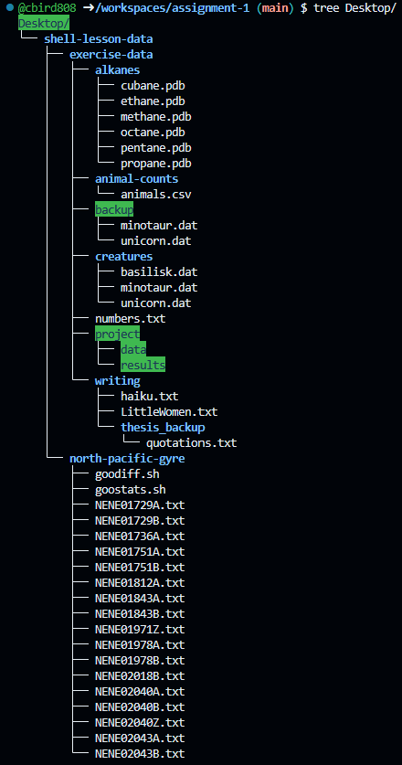

# Assignment 0

## Reading for Discussion Next lecture

[Wickham 2014 Tidy Data.pdf](../literature/Wickham_2014_Tidy_Data.pdf)

[Intro to GitHub](https://classroom.github.com/a/C_SLS9P8)

[Answer these questions based on the reading](https://forms.cloud.microsoft/r/cQjEwD96v7)

---

## [Intro to CLI Computing Using GitHub CodeSpaces](https://classroom.github.com/a/73VUVklZ) (click me!)

You will need to push the changes of your repo for this exercise to submit your assignment. Instructions are in the `README.md` in this assignment's repo.

> [!NOTE]
> the Software Carpentry Tutorial has changed since last year.  This is the directory structure you expect if you completed the commands correctly.  

You will be graded on how similar your directory structure is to this one.  
---

