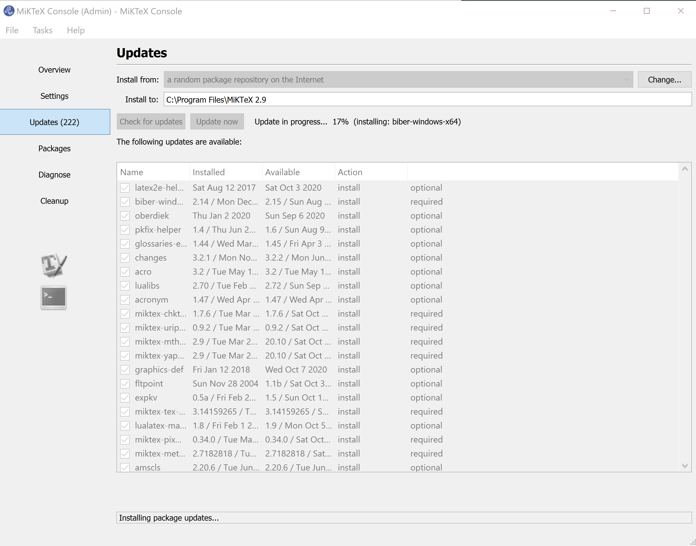
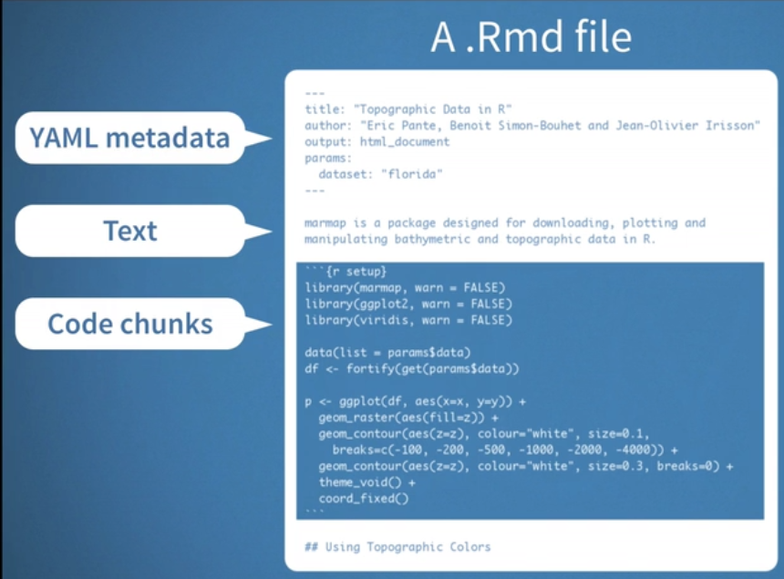

# Week09 R Markdown (Lite) 

###  No assignments were due today

[Lecture Stream](https://tamucc.zoom.us/rec/share/n-vLAmB1U6V9HPmYyPCAEJen-n60O4tDw5HdyGrQR001p8NCAqXcI78eZjfX4frn.1IcylHCClEx-nSSO)

Passcode: xqfR0*Bv

___

## Computer Preparation

You are expected to start this lecture with R Studio open with a fresh and empty text document in the upper left panel and a clean environment.

### *_GENERAL COMPUTER SETUP (SHOULD ALREADY BE DONE)_* 

<details><summary>Windows, Mac, Linux</summary>
<p>

- [ ] Step 0. Open Terminal

  > Search for the terminal app and open it.  For Windows, make sure you are using Ubuntu.

  > You should have already prepared your computer during Lecture 0.  If you did not then:  

  > * Complete the tasks listed in the [How to Set Up Your Computer for Computational Biology](https://github.com/tamucc-comp-bio/how_to/blob/main/howto_setup_computer.md), up to, but not including R and RStudio.
  >    * If you are having difficulty installing ubuntu, use Launch if your account is activated.

- [ ] Step 1. Update Your apps

  > It's always a good idea to keep your apps in your terminal up to date. 
  
  > For Ubuntu (Linux), enter the following commands to load the newest versions of your apps

  ```bash
  sudo apt update
  sudo apt upgrade
  ```

  > For Mac (Homebrew), enter the following commands to load the newest versions of your apps

  ```bash
  brew update
  brew upgrade
  ```

- [ ] Step 2. Confirm you have cloned the CSB (Computing Skills For Biologists) Repo into your home dir

    > In your terminal, enter the following commands:

    ```bash
    # make sure you're in your home dir
    cd ~
    
    # list the directories and files in the CSB dir to confirm it's in your home dir
    ls CSB
    ```

    > You should see the following output because we cloned the CSB Repo to your home dir in [Lecture 0](lecture00.md).  

    ```bash
    LICENSE  README.md  data_wrangling  git  good_code  latex  python  r  regex  scientific  sql  unix
    ```

    > If you see the output above, you're done! Goto the next section.

- [ ] Step 3. If you didn't have the CSB Repo, clone it now

  > If you **do not** see the output above, then clone the CSB repo by entering the following commands:

    ```bash
        git clone git@github.com:tamucc-comp-bio/CSB.git
    ``` 

  > You should see the following output:

    ```bash
    Cloning into 'CSB'...
    remote: Enumerating objects: 1005, done.
    remote: Total 1005 (delta 0), reused 0 (delta 0), pack-reused 1005 (from 1)
    Receiving objects: 100% (1005/1005), 26.68 MiB | 7.74 MiB/s, done.
    Resolving deltas: 100% (389/389), done.
    ```

  > Goto Step 2 above.

<hr style="height: 0.1px; border: none; background-color: black;">

</p>
</details>

<details><summary>ChromeOS, iOS, Android</summary>
<p>

  Launch a CodeSpaces VM Using the [Lecture 6 CodeSpaces VM Link](https://classroom.github.com/a/2TUfFuyt)
 
 Follow the Win/Mac/Linux instructions above
 
 </p>
</details>

### *_ADDITIONAL COMPUTER SETUP (NEW FOR TODAY)_* 

R Markdown is a typesetting language that allows you to also incorporate R code chunks.  If you did not notice yet, the solutions for the Data Wrangling chapter of CSB are written in R Markdown.  There are a variety of applications of R Markdown.  The one I have used the most is making a report where the data changes through time, but the layout of figures and text does not change.

> [!CAUTION]
> RMarkdown runs much more slowly than normal R code. If you need the fastest processing possible in R, don't use RMarkdown.

1. For R Markdown to work properly, you need some additional packages installed in R Studio. Realize that R can also process R Markdown scripts from terminal without R Studio.

```r 
install.packages("rmarkdown")
install.packages("knitr", dependencies=TRUE)
install.packages("tinytex")
tinytex::install_tinytex()

library(rmarkdown)
library(knitr)

```

2. (OPTIONAL) As of 2025, RStudio installs a lite version of `pandoc`, so you don't need to install it.  If you want the full featured version of `pandoc`, you can install it on your computer outside of RStudio following the instructions [here](https://pandoc.org/installing.html).  Windows people, do the windows install (the `*.msi` installer, not the `*.zip`). 

3. (OPTIONAL ) As of 2025, [TinyTex](https://yihui.org/tinytex/) can be used to install a lite version of LaTeX and if you followed the instructions above, you've already installed it. A LaTeX package enables the ability to create PDFs and other file types.  TinyTex is a small LaTeX package designed to work with `knittr`. If you want a full featured LaTeX distribution, you should install scientific typesetting software `LaTeX` that operates independently of R and RStudio. Like `Linux`, there are several flavors of `LaTeX`.  For linux: `sudo apt-get install texlive`.  For mac, [install MacTex](https://www.tug.org/mactex/mactex-download.html).  For windows, [install MikTex](https://miktex.org/download) - be sure to install as administrator and run updates.




> If you are successful, you will be prompted to restart `MiKTex`

</p>
</details>

<details><summary>MacOS</summary>
<p>

May the force be with you.  Let me know if I should add anything here.

</p>
</details>

---


## I. R Markdown

R Markdown is a flavor of the markdown typesetting language that works specifically with R.  You can use R markdown to create web pages, pdfs, slide shows, and other types of documents.

There is an [R Markdown Chapter in R for Data Science](https://r4ds.had.co.nz/r-markdown.html) that will cover more details than we will here. 


<details><summary>Creating an R Markdown Document</summary>
<p>

### Creating an R Markdown Document

In R Studio, make a new R Markdown document using the `File` pulldown menu

* name it `lesson-0`

* use default settings

If you were successful, your document will already be populated with several lines of text and code that fall into three categories.



Make sure you save the file as lesson-0 into your `CSB/data_wrangling/sandbox` and make sure that you use `setwd()` to set your present working directory to `CSB/data_wrangling/sandbox`.

___

</p>
</details>

<details><summary>Run `lesson-0.rmd` With `knitr`</summary>
<p>

## Run `lesson-0.rmd` With `knitr`

As is our custom in Computational Biology, jump in head first and click the `knit` button above the upper left panel. It will run the Rmd and create an `html` report in a new window.

Next, we will cover the primary sections of the Rmd file.

___

</p>
</details>

<details><summary>YAML Header</summary>
<p>

### YAML Header

YAML stands for YAML Aint Markup Language.

Lines 1-4 in the Rmd are the YAML header, which contains the title of the document and the default output format.  `html` is hyper text markup language, i.e. web pages.  The YAML header is always at the beginning of an Rmd.

Several other characteristics of the Rmd document can be set in the YAML header.  This [tutorial](https://zsmith27.github.io/rmarkdown_crash-course/lesson-4-yaml-headers.html) is pretty good.

---

</p>
</details>

<details><summary>Code Chunks</summary>
<p>


### Code Chunks

Lines 6-8, 16-18, and 24-26 are code chunks.  They start with three tick marks (the key in the upper left of you keyboard) and you can specify the language (r and other languages like python are possible), as well as basic settings of how the output from the code should be handled. For example, you can suppress warnings, error messages, etc.

The output of the code chunks are included in the resulting document.

---

</p>
</details>

<details><summary>Markdown Text</summary>
<p>


### Markdown Text 

Everything else in the Rmd is markdown text if it is not code or YAML.  

For example, line 12 is the first line of text.  The `##` indicates that the text `R Markdown` should be a secondary heading.

Markdown is a class of typesetting languages.  There are broad similarities across markdown languages but there can also be small differences.  This lecture is written in markdown and I make sure it works on GitHub.  The markdown in an Rmd can be slightly different. 

You can consult the 

#### [R Markdown Reference Guide](https://www.rstudio.com/wp-content/uploads/2015/03/rmarkdown-reference.pdf) 

and 

[R Markdown Cheatsheet](https://posit.co/wp-content/uploads/2022/10/rmarkdown-1.pdf) 

for all of the formatting options.

---

</p>
</details>

<details><summary>R Markdown Resources</summary>
<p>

[Official RMarkdown Tutorial](https://rmarkdown.rstudio.com/lesson-1.html)

[Official R Markdown Reference Guide](https://www.rstudio.com/wp-content/uploads/2015/03/rmarkdown-reference.pdf) 

[Official R Markdown Cheatsheet](https://posit.co/wp-content/uploads/2022/10/rmarkdown-1.pdf)

[Zachary Smith's R Markdown Crash Course](https://zsmith27.github.io/rmarkdown_crash-course/index.html)

[R for Data Science: R Markdown Chapter](https://r4ds.had.co.nz/r-markdown.html)

[R Markdown Cookbook - most comprehensive](https://bookdown.org/yihui/rmarkdown-cookbook/)

---

</p>
</details>


<details><summary>R Markdown Tutorial</summary>
<p>

### [Lesson 1](https://rmarkdown.rstudio.com/lesson-1.html)

R Markdown has a very nice lesson plan that we will use to review its features.  We will link to the lesson below and then work within the R Markdown website. There is also the very thorough [R Markdown Crash Course](https://zsmith27.github.io/rmarkdown_crash-course/index.html) by Zachary M. Smith (I love `open source`) which goes beyond the scope of this class.

Files needed for R Markdown lesson:

* [all *.Rmd` files here](Week09new_files/)

---

</p>
</details>

---

## II. Complete Assignment 8, Data Wrangling

Complete these exercises and push your changes to the repo before the end of class.


